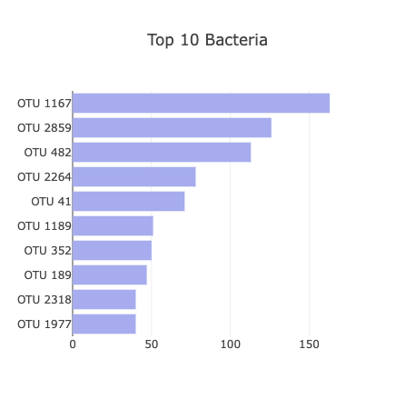
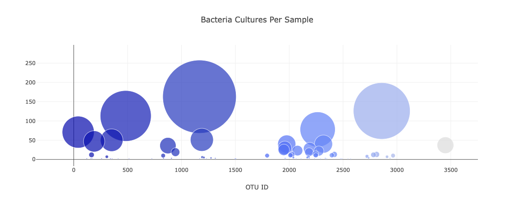

# Belly Button Biodiversity

## Descripton

This is an interactive dashboard to explore the Bellybutton Biodiversity dataset, also located in `data/samples.json`, which catalogs the microbes that colonize human navels.

The dataset reveals that a small handful of microbial species (also called operational taxonomic units, or OTUs, in the study) were present in more than 70% of people, while the rest were relatively rare.

## Dashboard Features

  **Drop Down Menu**

- Select the Test Subject ID drNo. with the drop down menu to toggle the visualizations (bar, gauge, bubble charts)

  **Demographic Info Panel**

- This Panel shows the demographics information of the chosen test subject
- Displays each key-value pair from the metadata JSON object
  

  
  **Horizontal Bar Graph**

- A bar chart is generated when a test subject is selected on the drop menu
- The top 10 OTUs found in that test subject will be displayed in bars, where the `sample_values` are presented as the values for the bar chart and the `otu_ids` presented as the labels for the bar chart
- When a user hover over a bar, the `otu_labels` are presented as the hovertext for the chart

  **Bubble Chart**

- A bubble chart is generated when a test subject is selected on the drop menu
- Each sample will be display as a bubble, where the larger the sample value is the larger the bubble size
- On the chart, the x values are the `otu_ids`, the y values are the `sample_values`
- The colors of the bubbles are based on `otu_ids`, and the hovertext are the `otu_labels`
  

